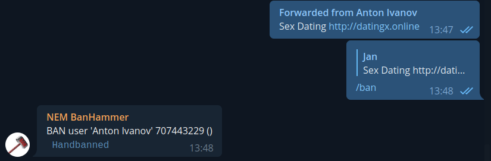
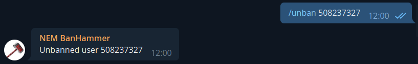

# BanHammer bot

## Features
1. Spam removing
2. "Joined" message removing
3. User management
   * Banning user
   * Unbanning user
   * Blacklisting user
   * Whitelisting user
4. Bot management
   
## 1. Spam removing
Bot provides automatic spam detection. Every message is scanned and evaluated. If it reaches certain score of spamness, bot deletes such a message and kick its author out of the chat group. In addition to that: 
* bot kicks the author out of all other groups where the bot is added
* bot puts the author on a blacklist, preventing the author joing any group where the bot is added

Every positive hit is reported in bot's admin chat group with a brief description. This gives other admins oportunity to monitor bot's actions. If a positive hit is evaluated as false positive by (human) admin, he can then command the bot to remove the author from a blacklist and unban him in all groups. However, the author himself must join all the chats again.

## 2. "Joined" message removing
Bot deletes every system message that informs of a user joing a chat group.

## 3. User management
Bot provides several commands for managing users across all groups where it is added. All these commands has to be run in bot's admin group chat.

### Banning user
An admin must first forward a message of a user who is to be banned. This marks the user for the bot. Admin then reply to this forwarded message with /ban command. Bot puts the author of the message on a blacklist and kicks him from every chat group. User that is on whitelist can not be banned.

### Unbanning user
Use /unban command with user ID as an argument. User ID is a number and you will find it in bot's response to the banning. The user will be unbanned in all chat groups and removed from a blacklist.

### Blacklisting user
Use /blacklist with user ID as an argument. User ID is a number and you will find it in bot's response to the banning. The user will be put on blacklist and removed from whitelist (if on it). This will not result in immediate ban. The user will be banned when joined or posted in a chat.

### Whitelisting user
Use /whitelist with user ID as an argument. User ID is a number and you will find it in bot's response to the banning. The user will be put on whitelist and removed from blacklist (if on it). This will save the user from any banning by the bot. If the user was banned prior to whitelisting, you must also use /unban to lift the current restrictions in all chats.

## 4. Bot management
In order to add the bot to a new chat group, one must authorize that chat by executing /enable command. Without authorization the bot will leave the new chat immediately after joining. /enable takes one arugment and that is a chat ID 

[!Chat authorized](sc-enabled.png)

Use /whereami to see where the bot is added

[!Whereami](sc-whereami.png)
